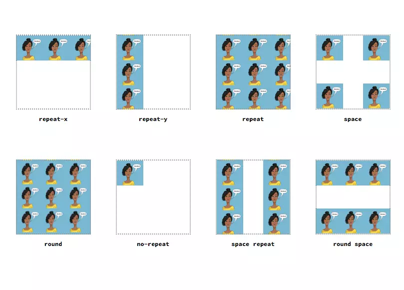

1. Hiểu đơn giản CSS Selector là thứ cho phép bạn nhắm mục tiêu tới các phần tử HTML để áp dụng các thuộc tính CSS cho chúng.

CSS Selector giống như là đường đẫn, chỉ định để cho CSS biết bạn đang muốn điều chỉnh, tạo kiểu cho phần tử HTML nào vậy.

Example: p {color: blue}
         |
         Selector

2. 

Các dạng rule |  thứ tự ưu tiên 
    Inline    |        1
    Id        |        2
    Class     |        3
    tag       |        4

Example: 

div p.text {
  font-size: 14px;
}
#header p {
  font-size: 20px;
}

===> kết quả là 20px Tại vì #id nó ưu tiên hơn thẻ bình thường hơn class nên nó sẽ lấy CSS đoạn ở dưới

3. 

các cách hiển thị background-image
I. background-repeat: chọn kiểu lặp lại của ảnh nền
Example: .top-outer-left { background-repeat: repeat-x; }
.top-inner-left { background-repeat: repeat-y; }
.top-inner-right { background-repeat: repeat; }
.top-outer-right { background-repeat: space; }

.bottom-outer-left { background-repeat: round; }
.bottom-inner-left { background-repeat: no-repeat; }
.bottom-inner-right { background-repeat: space repeat; }
.bottom-outer-right { background-repeat: round space; }

4. 
Đơn vị tương đối - Relative Units:
I. % (percentages): Đơn vị tương đối về kích thước của phần tử con so với phần tử mẹ (parrent). Ví dụ: Nếu phần tử mẹ có thuộc tính width:500px, phần tử con có thuộc tính width:50% thì có nghĩa là phần tử con có thuộc tính width:250px

II. em: Là đơn vị tương đối dựa vào thuộc tính font-size của phần tử mẹ. Ví dụ: Nếu phần tử mẹ có thuộc tính font-size:16px, phần tử con có thuộc tính font-size:2em thì có nghĩa là phần tử con có thuộc tính font-size:32px

III. rem(root em): Là đơn vị tương đối dựa vào thuộc tính font-size của phần html (root element). Ví dụ: Nếu phần tử html có thuộc tính font-size:12px phần tử mẹ có thuộc tính font-size:16px, phần tử con có thuộc tính font-size:2rem thì có nghĩa là phần tử con có thuộc tính font-size:24px; Tức là đơn vị rem không phụ thuộc vào phần tử mẹ.

Đơn vị tuyệt đối - Absolute Units:
px *: pixels (1px = 1/96th of 1in)
pt: points (1pt = 1/72 of 1in)
pc: picas (1pc = 12 pt)
cm: centimeters
mm: millimeters
in: inches (1in = 96px = 2.54cm)

5. 

div là thẻ được dùng để nhóm nhiều phần tử HTML lại với nhau hẻ 
 là thẻ đánh dấu một khối (block) gồm nhiều thẻ khác trong khối. Như tên gọi, thẻ 
 giúp các tài liệu HTML được chia thành các phần (khối) riêng biệt.

example: 

    
 dinh nghia the div la gi 

    
 tac dung cua the div trong HTML 

    
 phan biet su khac nhau giua the span va the div 

Trong ví dụ trên, nguyên cụm text gồm 3 dòng được nhóm lại. Chúng có chung định dạng cỡ chữ size 20 và màu chữ là đỏ. Nếu bạn muốn thay cả cụm 3 dòng này thành màu xanh dương, chỉ cần thay giá trị “red” trong câu lệnh bằng “blue” là được. 

span:
thẻ  là một thẻ không có ý nghĩa ngữ nghĩa mà được sử dụng để đánh dấu một phần văn bản hoặc một phần tử nhỏ hơn trong một đoạn văn

example: 

Đây là ví dụ về thẻ span

Qua ví dụ trên bạn sẽ thấy thẻ 
 có thể chứa được  còn  thì không thể chứa được 
. Nó chỉ dùng để gom nhóm phần tử kiểu inline mà thôi.

6. 
Để thêm đường viền cho phần tử HTML bạn sử dụng thuộc tính CSS có tên border, giá trị cho thuộc tính này bạn viết trên một dòng thể hiện tính chất đường viền mong muốn, gồm ba giá trị là size style color, cú pháp là:

border: size style color;
size : độ dày đường viền (như 1px, 2em ...)
style : kiểu đường viền, nó nhận các giá trị như none, hidden, dotted, dashed, solid, double, groove, ridge, inset, outset, hay dùng kiểu dotted - đường nét chấm chấm, dashed đường nét đứt, solid đường nét liền
color : mã màu của đường viền (xem mã màu trong HTML, CSS) hay tên các màu sắc như red, blue, green, black, white, yellow ...
Như mã CSS tạo ra đường độ dày 2px, kiểu đường liền solid, màu đường là đỏ red, thì bạn viết:

Example:
border: 2px solid red;

Margin:
Thuộc tính margin canh lề cho thành phần.

Example:

div p {
    background: #66CC00;
    margin: 10px 0 0 0;
}

Dòng margin ở trên tương đương với các giá trị sau:
margin-top: 10px;
margin-right: 0
margin-bottom: 0
margin-left: 0

Padding: 
Thuộc tính padding thêm vào khoảng không cho thành phần.

Example: 

div p {
    background: #66CC00;
    padding: 20px 0 0 0;
}

Dòng padding ở trên tương đương với các giá trị sau:
padding-top: 20px;
padding-right: 0
padding-bottom: 0
padding-left: 0

7. 
Các font family hay dùng cho web
1 Helvetica (sans-serif) Helvetica is one of the most popular and versatile fonts in the world. ...
2 Arial (sans-serif) Arial is the most widely used sans-serif font on the web. ...
3 Arial Black (sans-serif) ...
4 Verdana (sans-serif) ...
5 Tahoma (sans-serif) ...
6 Trebuchet MS (sans-serif) ...
7 Impact (sans-serif) ...
8 Gill Sans (sans-serif)